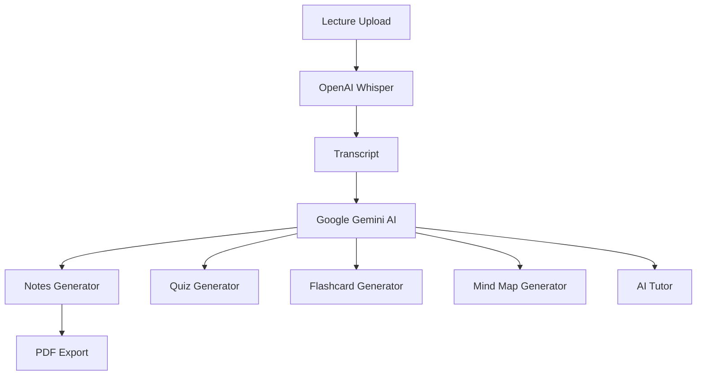

# 🎓 LectureGPT

An AI-powered educational platform that transforms lecture recordings into comprehensive study materials. LectureGPT Pro leverages OpenAI Whisper for speech-to-text transcription and Google Gemini AI for generating notes, quizzes, flashcards, mind maps, and an interactive AI tutor experience.

---

## Project Overview

LectureGPT Pro is designed to help students learn efficiently by converting lecture audio and video recordings into structured educational resources.

After uploading a lecture recording, the system automatically:

* Transcribes speech into text
* Generates structured study notes
* Creates multiple-choice quizzes
* Produces flashcards for revision
* Builds visual mind maps
* Enables interactive question-answering through an AI Tutor
* Exports notes as PDF

The application is deployed using Google Colab and Gradio, making it accessible without complex setup.

---

## Features

### 🎙 Lecture Transcription

* Upload audio or video lectures
* Speech-to-text conversion using OpenAI Whisper
* Supports long-duration lectures
* Automatic transcript generation

### 📚 Smart Notes Generation

Generate:

* Detailed Notes
* Exam Notes
* Revision Notes

Features:

* Topic-wise organization
* Key concepts
* Definitions
* Examples
* Important formulas

### 🧠 Quiz Generator

* Easy Level MCQs
* Medium Level MCQs
* Hard Level MCQs
* Answer explanations

### 🎴 Flashcard Generator

* Question-answer format
* Quick revision support
* Improves retention

### 🗺 Mind Map Generator

* Mermaid-based visual mind maps
* Topic hierarchy visualization
* Concept relationship mapping

### 💬 AI Tutor

* Ask questions from the lecture
* Context-aware responses
* Personalized explanations
* Interactive learning experience

### 📄 PDF Export

* Export generated notes
* Download study material
* Offline learning support

### 📊 Lecture Analytics

* Word count
* Estimated study time
* Transcript statistics

---

## System Architecture



---

## System Workflow

1. Upload Lecture Audio/Video
2. Generate Transcript using Whisper
3. Analyze Transcript using Gemini
4. Generate Study Notes
5. Generate Quiz Questions
6. Generate Flashcards
7. Generate Mind Maps
8. Ask Questions via AI Tutor
9. Export Notes as PDF

---

## Technology Stack

| Layer           | Technologies            |
| --------------- | ----------------------- |
| Frontend        | Gradio                  |
| Backend         | Python                  |
| Speech-to-Text  | OpenAI Whisper          |
| Generative AI   | Google Gemini 2.5 Flash |
| PDF Generation  | FPDF                    |
| Deployment      | Google Colab            |
| Visualization   | Mermaid                 |
| Version Control | Git & GitHub            |

---

## Folder Structure

```text
LectureGPT-Pro/
│
├── notebooks/
│   └── LectureGPT.ipynb
│
├── assets/
│   ├── screenshots/
│   └── diagrams/
│
├── exports/
│   └── generated_pdfs/
│
├── README.md
│
└── requirements.txt
```

---

## Installation

### Prerequisites

* Python 3.10+
* Google Gemini API Key
* Google Colab Account

---

### Install Dependencies

```bash
pip install gradio
pip install google-generativeai
pip install openai-whisper
pip install fpdf2
pip install python-docx
```

---

## Environment Variables

Create a Gemini API Key:

```python
GEMINI_API_KEY="YOUR_API_KEY"
```

Get API Key:

https://ai.google.dev

---

## Running the Application

### Google Colab

1. Open the notebook.
2. Add Gemini API key.
3. Run all cells.
4. Launch Gradio app.
5. Use the generated public URL.

---

## User Workflow

### Step 1

Upload:

* MP4
* MP3
* WAV
* M4A

### Step 2

Generate Transcript

### Step 3

Generate:

* Notes
* Quiz
* Flashcards
* Mind Maps

### Step 4

Ask questions using AI Tutor

### Step 5

Export Notes as PDF

---

## Future Enhancements

* Multi-language transcription
* Real-time lecture summarization
* Voice-enabled AI Tutor
* Mobile Application
* Cloud Storage Integration
* Personalized Study Plans
* Learning Progress Tracking
* LMS Integration
* DOCX Export Support
* PowerPoint Export Support

---

## References

1. Google Gemini API Documentation
   https://ai.google.dev

2. OpenAI Whisper Documentation
   https://github.com/openai/whisper

3. Gradio Documentation
   https://www.gradio.app/docs

4. Python Documentation
   https://docs.python.org/3

5. Google Colab Documentation
   https://colab.research.google.com

6. FPDF2 Documentation
   https://py-pdf.github.io/fpdf2

7. Mermaid Documentation
   https://mermaid.js.org

8. GitHub Documentation
   https://docs.github.com

---

## Author

**AMARAVADI SANJAY**

---

<p align="center">
Built with ❤️ using Whisper, Gemini AI, Gradio, and Python
</p>
